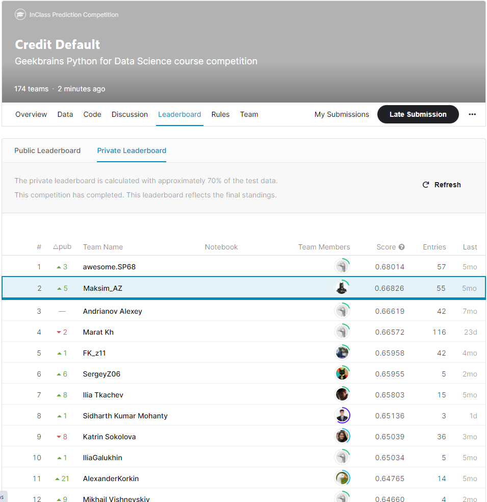

# Classification project (Kaggle) #
### __Results: 2-place Private Leaderboard (Top 1%) -[Maksim_AZ]. Score(f1-score): 0.66826, Model: XGBClassifier__ ###
### Задача  - предсказать факт невыполнения кредитных обязательств ###
__Ссылка на соревнование: https://www.kaggle.com/c/gb-credit-default__
__Ссылка на профиль: https://www.kaggle.com/maksimaz__

|N|Data fields|Description
|------|-------------------|----------|
1|Home Ownership|домовладение
2|Annual Income|годовой доход
3|Years in current job|количество лет на текущем месте работы
4|Tax Liens|налоговые обременения
5|Number of Open Accounts | количество открытых счетов
6|Years of Credit History | количество лет кредитной истории
7|Maximum Open Credit | наибольший открытый кредит (максимальная сумма, которая когда-либо была доступна клиенту)
8|Number of Credit Problems | количество проблем с кредитом
9|Months since last delinquent | количество месяцев с последней просрочки платежа
10|Bankruptcies | банкротства
11|Purpose | цель кредита
12|Term | срок кредита
13|Current Loan Amount | текущая сумма кредита (сумма, которую еще предстоит выплатить клиенту)
14|Current Credit Balance | текущий кредитный баланс (сумма, которую может тратить клиент с кредитного счета)
15|Monthly Debt | ежемесячный долг
16|Credit Score | баллы кредитного рейтинга
17|Credit Default | факт невыполнения кредитных обязательств (0 - погашен вовремя, 1 - просрочка)

