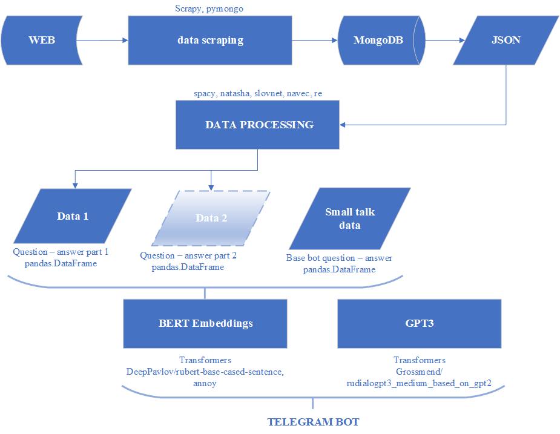
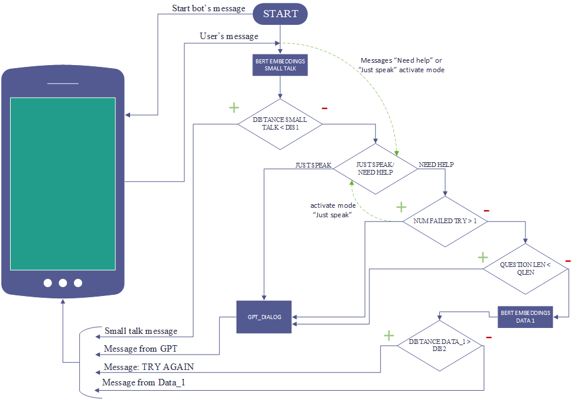

# TELEGRAM CHAT-BOT PROJECT
## "prototype **bot-psychotherapist**"
--------------------------------------
## Used stack: 
### 1) Scraping (Scrapy, pymongo -> JSON)
### 2) NLP (spaCy, re), NER (natasha, navec, slovnet)
### 3) transfomers - BERT (DeepPavlov/rubert-base-cased-sentence),
### 4) transfomers - GPT (Grossmend/rudialogpt3_medium_based_on_gpt2)
### 5) telegram, logging
----------------------------------------------
## Data from  **https://psychoambulanz.ru/**
# Project steps

# Telegram logic

# Some results:

